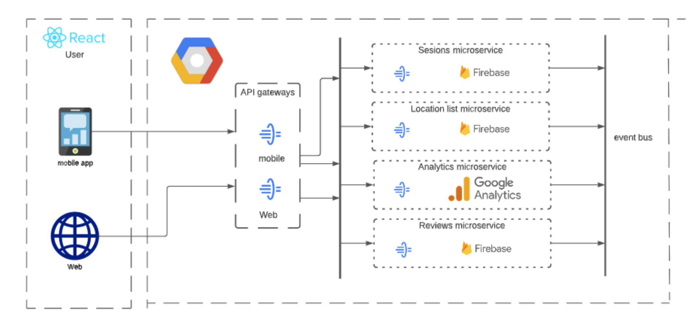

# Google Reviews
---

<div align="center">
    
</div>

# 👾 Description

## Our proposal
Use the current infrastructure of google to provide all the reviews inside an specific app, being it web, where the user can look into a specific area near him or valuable to him through the businesses near, give a better description of the business and generally improve the aggregated value to each one of the businesses. Its core value is to improve the interrelationship between the user and the businesses by optimizing the functionality already described, as the reservation function. Also base the technology with google since the  competition already is based on google technology.  Moreover the functionality of routes it’s left in the google maps application so the specific target of the app are the companies and the user, improving the performance and even giving certain status to the business as tripadvisor does. 

## Scope
Position Google Reviews as the most reliable place to look for a place based on different values by listening to the users on what they like and giving a specific status to the companies in the app, as well as maintain the interactions only to the google technology.


<div align="center">
    
</div>

---
# 🚀 How to run it
    
First you need to make sure you have installed Node and npm installed.
    
Then clone the repo and change to the directory of the project:
```ssh
git clone git@github.com:saulmontesdeoca/GoogleReviews.git
cd GoogleReviews
```

At the root level you should create a .env file containing the following:

```ssh
REACT_APP_APIKEY= <YOUR-KEYS>
REACT_APP_AUTH_DOMAIN= <YOUR-AUTH-DOMAIN>
REACT_APP_PROJECT_ID= <YOUR-PROJECT-ID>
REACT_APP_STORAGEBUCKET= <YOUR-KEYS>
REACT_APP_SENDER= <YOUR-KEYS>
REACT_APP_APPID= <YOUR-KEYS>
REACT_APP_MEASUREMENT= <YOUR-KEYS>
REACT_APP_GOOGLE_MAPS_API_KEY= <YOUR-KEYS>
```

Then perform the following commands

```ssh
npm install
npm start
```

Head to localhost:3000/

Now open a browser and head to **'localhost:80'**.
# 💾 Databases

Firebase Firestore Data Structure:

```
- GoogleReviews/
    - Locations/
        - Name
        - Address
        - Suburb
        - City
        - Price
        - Rating
        - MainPhoto
        - Photos
        - ReviewsIds
        - Schedule
        - Type
        - uid
    - Reviews/
        - id
        - idUser
        - Review
        - Price
        - Rating
        - createdAt
        - userName
        - Photos
    - Users/
        - id
        - createdAt
        - displayName
        - email
        - photoURL
        - reviewCount
        - reviewsIds
```


# 🏛 Architecture

The architecture must be in microservices in the cloud and using Google API Gateways. The data will be handled in Firebase, data and queries will be handled in the backend to avoid access to alterations by users. The Google Analytics service is used. Services should be able to scale up or down as required. The solution will be deployed in the Google Cloud Platform.

<div align="center">
    
</div>


# 🎨 Frontend

React folder structure:

```
- google-reviews/
    - public/
    - src/
        - components/
           ...
        - hooks/
          ...
        - pages/
           ...
        - store/
          ...
        - util/
          ...
        - App.js
        - index.css
        - index.js
```
